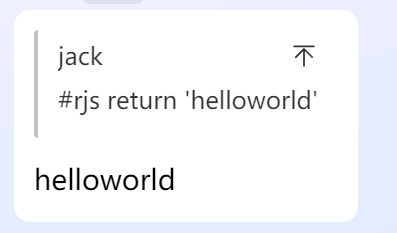

# 使用

直接使用build分支中js文件放入karin项目内/plugins/karin-plugin-example目录下

建议直接在/plugins目录中使用 `git clone -b build https://github.com/jacksixth/karin-plugin-jacksixth-app.git`拉取,后续有更新可以直接 `git pull`拉取更新

或者下载releases里的压缩包放如 /plugins

# 功能

1. bilibili 链接解析 -> bilibili.js

   大概长这样

   
1. 每日定时获取新闻摸鱼日报发群里-> moyuribao.js

   需要在js文件中配置定时发布的时间与群号 看js文件中的注释
1. 执行js代码->runCode.js
   ```
   #rjs return 'helloworld'
   ```
   
1. 俄罗斯轮盘赌小游戏 

   可使用命令`开始游戏 【可开枪数】 【游戏模式】` 或者 `开始游戏` 来开始游戏

   游戏有2种模式

   - 单枪模式 - 群内共享一把枪
   - 多枪模式 - 每人持有一把枪